# Performance Evaluation System (Django)

A web-based performance evaluation platform built with Django, designed for multi-organization environments (holding / factory / department groups) with role-based access, workflow approvals, and manager/admin reporting.
This project is designed based on SaaS architecture principles for multi-organization environments.

## SaaS Architecture Highlights

Key SaaS architecture aspects implemented in this system:

- Multi-tenant structure (Holding / Factory / Department Group)
- Data isolation between organizations
- Organization-based data scoping and access filtering
- Role-based access control (Admin / Manager / Employee)
- Fully web-based platform (no installation required)
- Workflow-driven evaluation and approval engine
- Scalable reporting and evaluation workflows
- Designed for enterprise environments with multiple organizational units


## Key Features
- Multi-organization scoping (Holding, Factory, DepartmentGroup)
- Role-based access for Admins and Managers
- Evaluation workflow and approval states (signatures and audit-ready structure)
- Manager dashboards and reports (including print-friendly views)
- CSV / PDF / Print-ready reporting paths
- Structured import and maintenance scripts

## Tech Stack
- Python / Django
- PostgreSQL (intended for production)
- HTML, CSS, JavaScript (server-rendered templates)
- Chart.js for reporting visuals
- SharePoint Lists, Libraries, and Custom Views
- Portfolio & Resource Management Concepts

## Screenshots

### Login

<p align="center">
  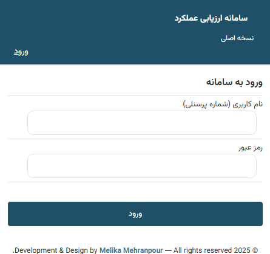
  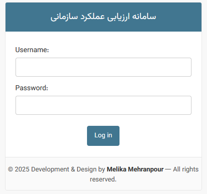
</p>
<p align="center"><sub>Personnel Login</sub> | <sub>Admin Login</sub></p>

---

### Manager Dashboard

<p align="center">
  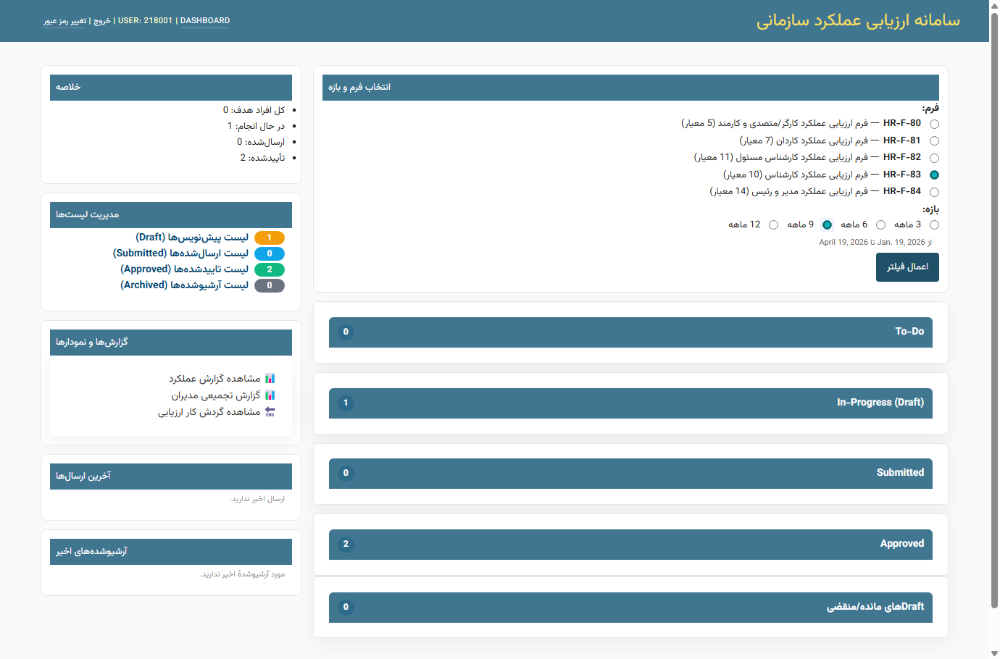
   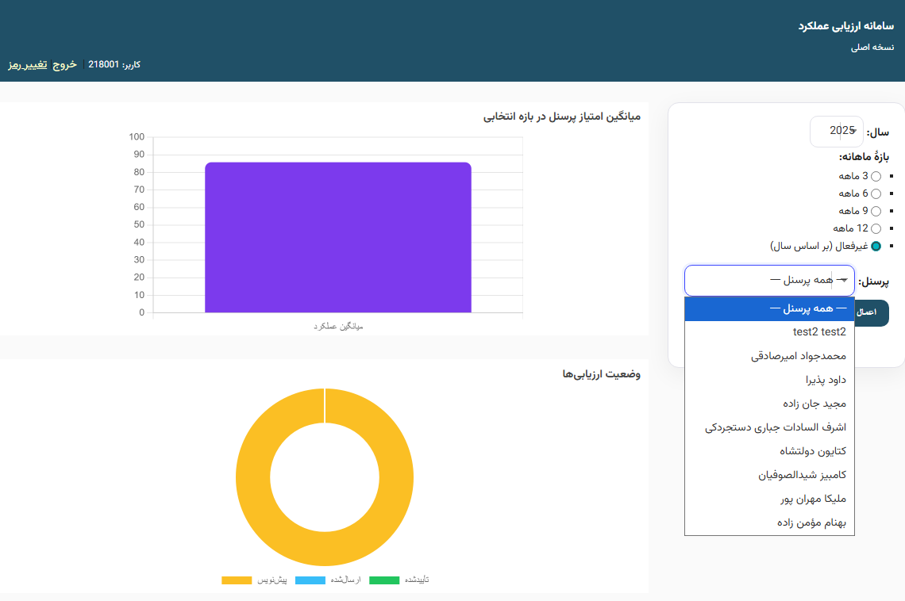
</p>
<p align="center"><sub>Managers Dashboard</sub> | <sub>Department Score Chart</sub></p>

---

### Workflow & Evaluation

<p align="center">
  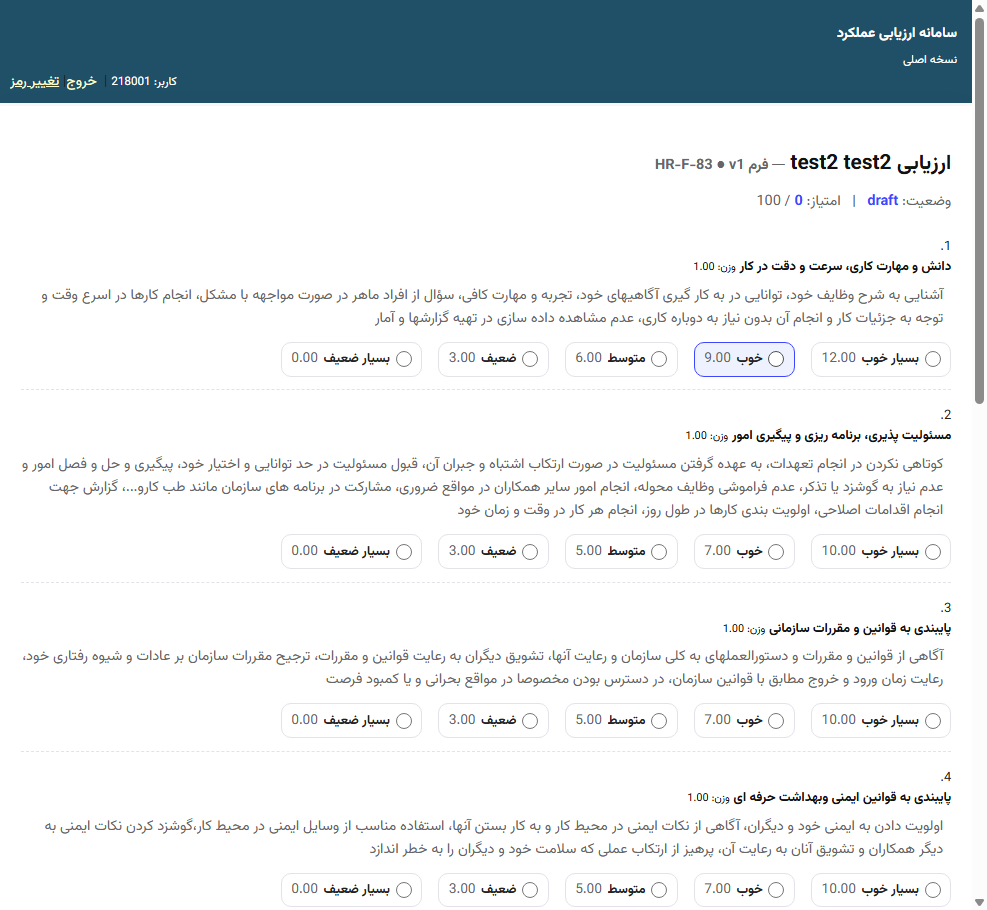
  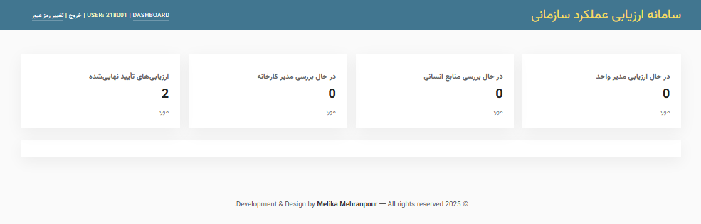
</p>

<p align="center"><sub>Performance Evaluation Form</sub> | <sub>Workflow and Approval Process</sub></p>


<p align="center">
  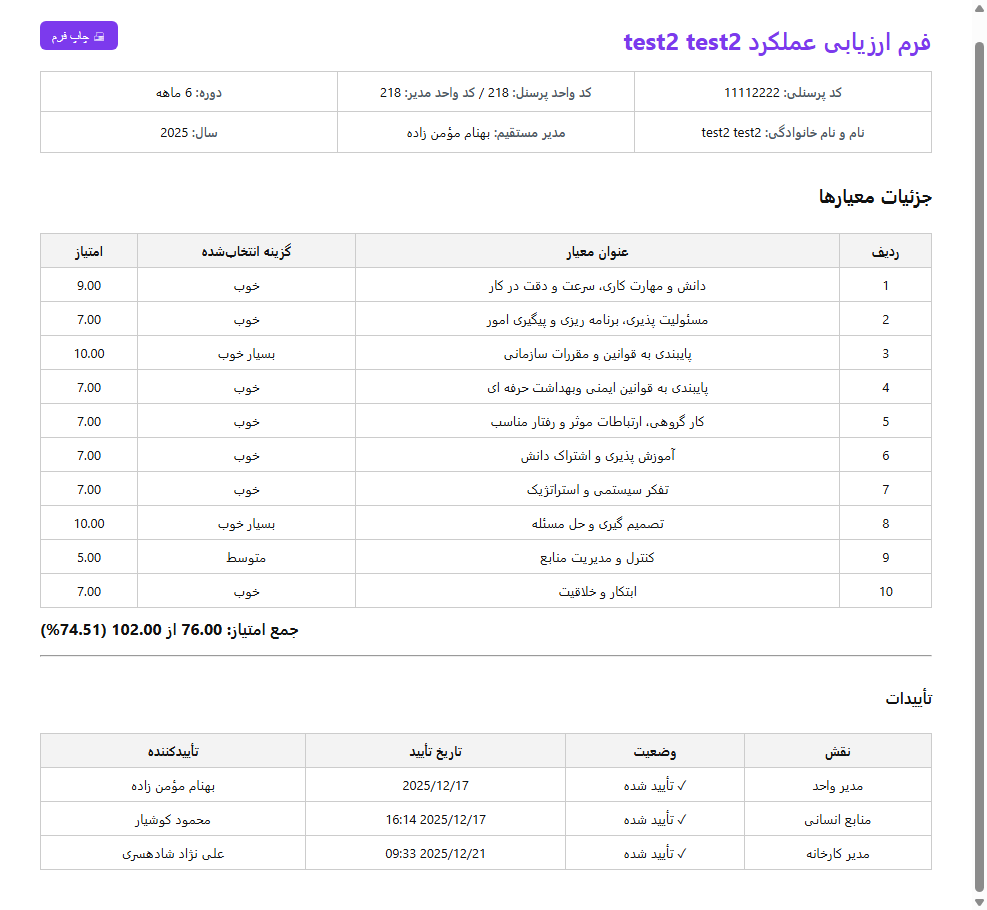
</p>

<p align="center"><sub>Workflow Form Print and Signatures</sub></p>

---

### Administration Panel

<p align="center">
  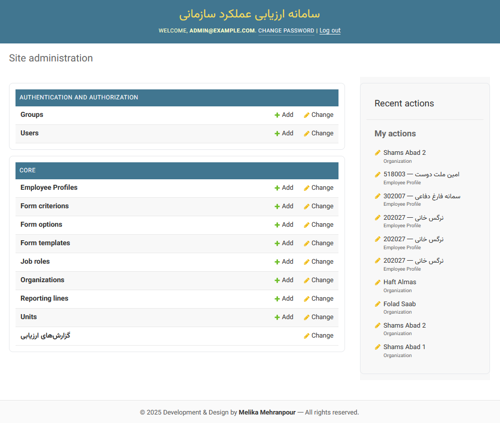
   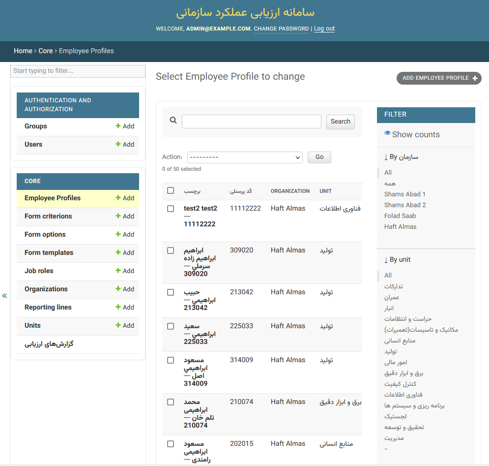
</p>

<p align="center"><sub>System Administration Panel</sub> | <sub>Personnel Management in Admin Panel</sub></p>


<p align="center">
  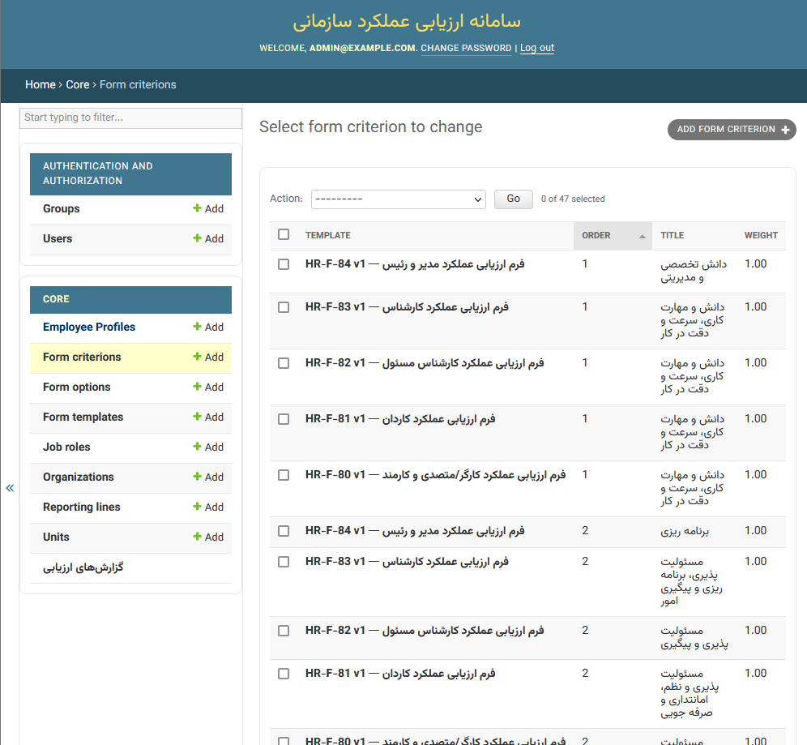
  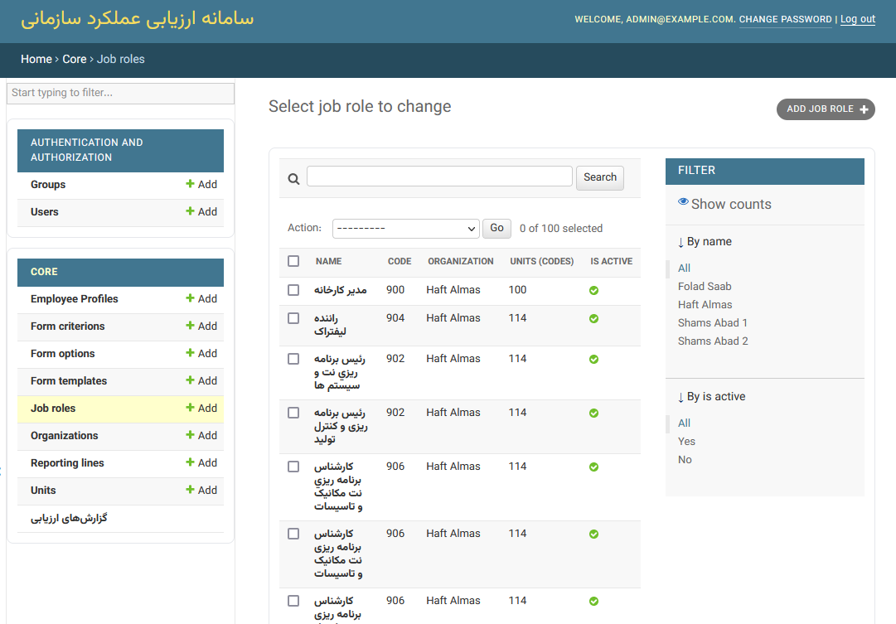
</p>

<p align="center"><sub>Evaluation Forms Management</sub> | <sub>Job Role Management</sub></p>

<p align="center">
  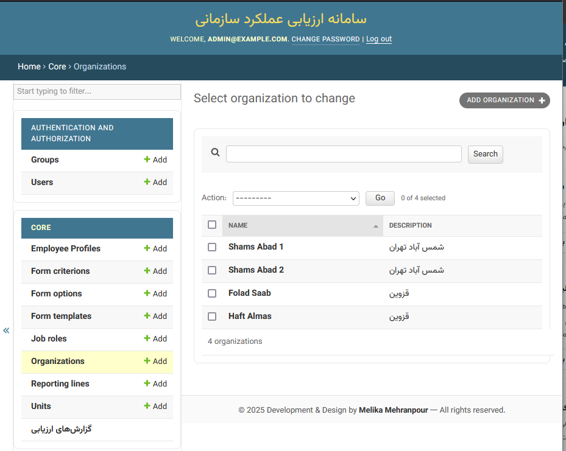
</p>

<p align="center"><sub>Multi-Organization Management</sub></p>


## Azure DevOps Project Management

During development, the project was managed in Azure DevOps using Boards, Work Items, Epics, and phase-based planning.

The project lifecycle was organized into seven phases, including architecture, implementation, testing, reporting, UI improvements, and DevOps finalization.

### Azure DevOps Screenshots

<p align="center">
  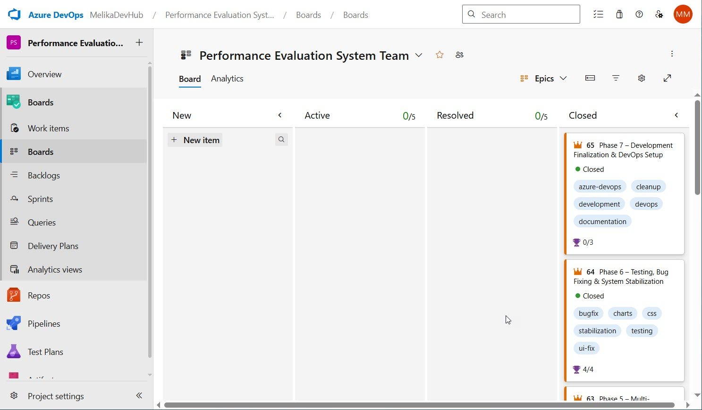
  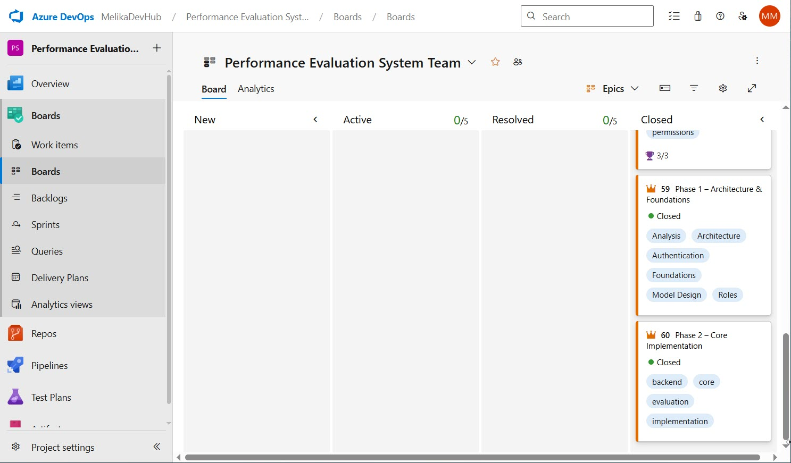
</p>

<p align="center">
  <sub>Work Items &nbsp;&nbsp;&nbsp;|&nbsp;&nbsp;&nbsp; Board Overview</sub>
</p>

<br>

<p align="center">
  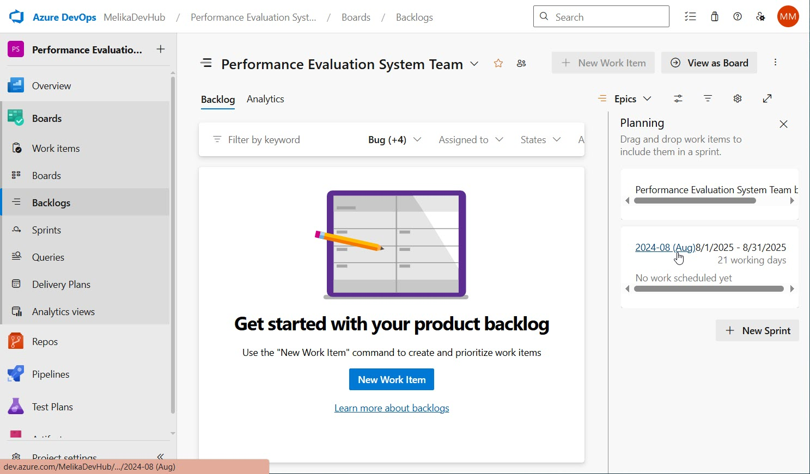
  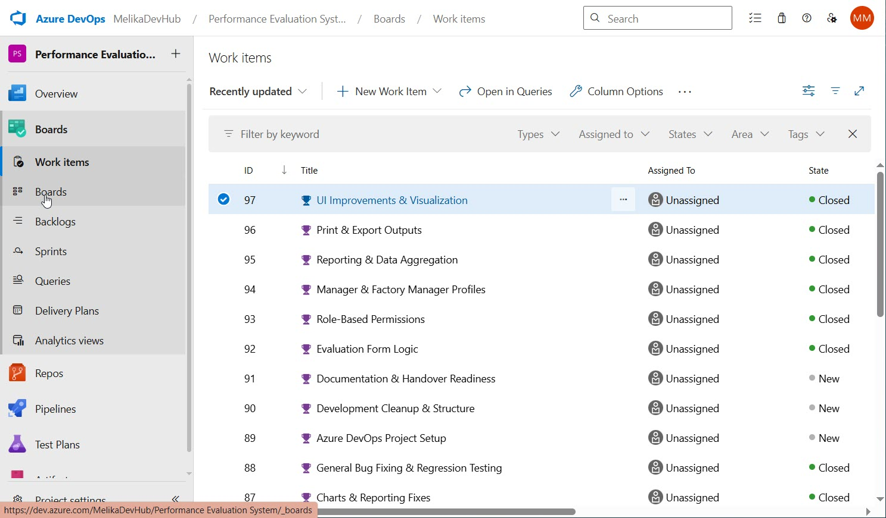
</p>

<p align="center">
  <sub>Project Phases &nbsp;&nbsp;&nbsp;|&nbsp;&nbsp;&nbsp; Backlog & Planning</sub>
</p>

## Repository Structure
- `core/` – Main application logic (models, views, approvals, workflow, templates, static files)
- `project/` – Django project configuration (settings, URLs, WSGI/ASGI)
- `scripts/` – Utility scripts for imports, analysis, and maintenance
- `docs/` – Technical documentation and design notes

### Database Design
The database schema is defined and managed through Django models and migrations, ensuring consistency across environments.


## Organizational Coding Structure

To improve consistency and avoid relying on free-text values, the system uses fixed numeric codes for organizational units, job titles, and job levels.

This approach was introduced because relying only on Persian display names caused several issues:

- Different spellings or wording for the same title or unit
- Difficulty in filtering, reporting, and workflow routing
- Hard-coded dependencies on Persian text values
- Reduced maintainability when names change over time
- Inconsistent mapping between employees, managers, units, and evaluations

Instead of using display text as the primary identifier, the application uses stable internal codes. Display names can change later without affecting business logic, permissions, reports, or workflow behavior.

### Benefits

- Consistent and normalized data across the system
- Easier filtering, reporting, and manager assignment
- Safer workflow routing and approval logic
- Better support for future multi-organization expansion
- Easier maintenance if department or title names are renamed

---

### Unit Codes

Each organizational unit has a unique code:

| Code | Unit |
|------|------|
| 202 | Lubricants |
| 207 | Finance |
| 208 | Quality / R&D |
| 210 | Electrical & Instrumentation |
| 212 | Production |
| 213 | Warehouse |
| 216 | Security |
| 217 | Civil |
| 218 | IT |
| 219 | Logistics |
| 222 | Quality Control |
| 307 | Mechanical |

These codes are used in employee profiles, evaluation routing, reports, and manager-level access control.

---

### Job Title / Job Level Codes

The system also defines stable codes for job hierarchy levels:

| Code | Job Title |
|------|------|
| 900 | Factory Manager |
| 901 | Unit Manager |
| 902 | Supervisor / Head |
| 903 | Team Lead / Shift Lead |
| 904 | Responsible Person |
| 905 | Employee |
| 906 | Specialist |
| 907 | Senior Specialist / Lead Specialist |
| 908 | Technician |

> Note: The visible job title may change in the future, but its code remains constant inside the system.

---

### Example Usage

```python
if employee.job_level_code == 900:
    # Factory Manager access
    ...

if employee.unit_code == 218:
    # IT department logic
    ...
```
By using stable internal codes instead of raw text values, the system becomes easier to maintain, safer for workflow and permission logic, and more scalable for future organizational and multi-company changes.


## Local Setup
1. Create and activate a virtual environment

2. Install dependencies:
   ```bash
   pip install -r requirements.txt
   ```

3. Configure environment variables locally (`.env` is excluded from version control)

4. Run migrations and start the server:
   ```bash
   python manage.py migrate
   python manage.py runserver
   ```

## Notes
- Sensitive data and local artifacts are excluded using `.gitignore`
- The project follows a clean commit history and modular structure


## Author

👩‍💻 **Melika Mehranpour**  
Senior Software Engineer | Backend & Enterprise Systems  
Python (Django) • PostgreSQL • System Design • Agile

🔗 [LinkedIn](https://www.linkedin.com/in/melika-mehranpour-41b627161/) | [GitHub](https://github.com/MelikaWorks)

## License
See the [LICENSE](LICENSE) file for license information.
